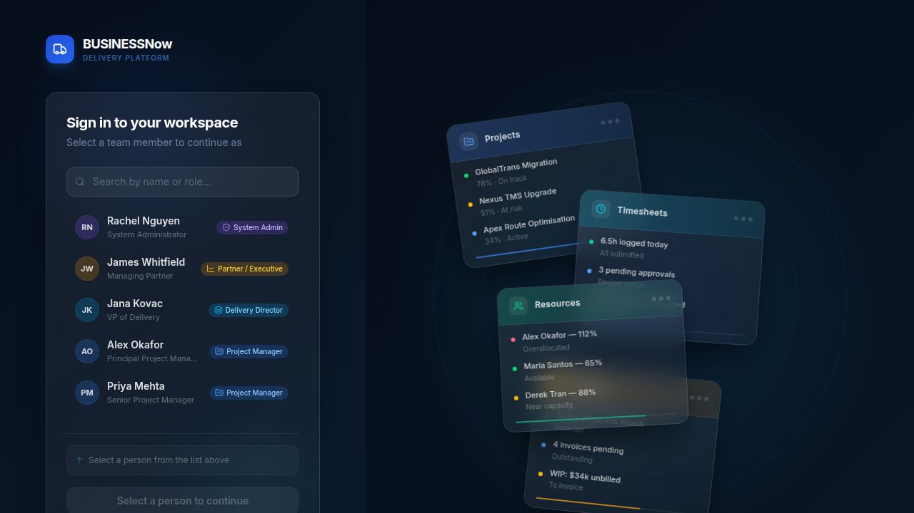

# BUSINESSNow — Delivery Command Center
## Comprehensive Product Job Card (PRD-Level)

> **Product:** BUSINESSNow  
> **Company:** KSAP Technologies — Oracle Transportation Management (OTM) Consulting Firm  
> **Version:** Sprint 7 (Security, Polish & Performance)  
> **Classification:** PSA — Professional Services Automation Platform  
> **Stack:** React 19 + Vite · Express 5 · Drizzle ORM · PostgreSQL · pnpm Monorepo  

---

## Table of Contents

1. [Product Overview](#1-product-overview)
2. [Technology Architecture](#2-technology-architecture)
3. [User Roles & Permissions](#3-user-roles--permissions)
4. [End-to-End Process Flow](#4-end-to-end-process-flow)
5. [UI Layout & Navigation System](#5-ui-layout--navigation-system)
6. [Module 1 — Authentication / Login](#6-module-1--authentication--login)
7. [Module 2 — PM Dashboard](#7-module-2--pm-dashboard)
8. [Module 3 — Admin Dashboard](#8-module-3--admin-dashboard)
9. [Module 4 — Projects](#9-module-4--projects)
10. [Module 5 — Project Detail (Command Centre)](#10-module-5--project-detail-command-centre)
11. [Module 6 — Milestones](#11-module-6--milestones)
12. [Module 7 — Tasks](#12-module-7--tasks)
13. [Module 8 — Time Logs (Timesheets)](#13-module-8--time-logs-timesheets)
14. [Module 9 — Timesheet Approval](#14-module-9--timesheet-approval)
15. [Module 10 — Customers (Accounts)](#15-module-10--customers-accounts)
16. [Module 11 — Customer Detail](#16-module-11--customer-detail)
17. [Module 12 — Prospects](#17-module-12--prospects)
18. [Module 13 — Opportunities](#18-module-13--opportunities)
19. [Module 14 — Team (Resources)](#19-module-14--team-resources)
20. [Module 15 — Resource Detail](#20-module-15--resource-detail)
21. [Module 16 — Assignments (Allocations)](#21-module-16--assignments-allocations)
22. [Module 17 — Staffing Requests](#22-module-17--staffing-requests)
23. [Module 18 — Capacity Forecast](#23-module-18--capacity-forecast)
24. [Module 19 — Finance Command](#24-module-19--finance-command)
25. [Module 20 — Invoices](#25-module-20--invoices)
26. [Module 21 — Rate Cards](#26-module-21--rate-cards)
27. [Module 22 — Change Orders](#27-module-22--change-orders)
28. [Module 23 — Contracts](#28-module-23--contracts)
29. [Module 24 — Portfolio (Executive View)](#29-module-24--portfolio-executive-view)
30. [Module 25 — Project Blueprints (Templates)](#30-module-25--project-blueprints-templates)
31. [Module 26 — PMO Settings](#31-module-26--pmo-settings)
32. [Module 27 — System Admin](#32-module-27--system-admin)
33. [Module 28 — External Client Portal](#33-module-28--external-client-portal)
34. [Module 29 — Command Palette (Global Search)](#34-module-29--command-palette-global-search)
35. [Database Schema Reference](#35-database-schema-reference)
36. [API Reference](#36-api-reference)
37. [Permission Matrix](#37-permission-matrix)
38. [Data Flows & Integrations](#38-data-flows--integrations)

---

## 1. Product Overview

**BUSINESSNow** is a full-stack Professional Services Automation (PSA) platform purpose-built for **KSAP Technologies**, an Oracle Transportation Management (OTM) consulting firm. It replaces spreadsheets, email threads, and disconnected tools with a single command centre for managing the entire lifecycle of consulting engagements — from lead capture through project delivery to invoicing and closure.

### Core Value Propositions

| Pillar | Description |
|--------|-------------|
| **Delivery Visibility** | Real-time project health, milestone tracking, task status across all active engagements |
| **Resource Intelligence** | Utilization heatmaps, capacity forecasting, conflict detection, staffing request workflows |
| **Revenue Operations** | WIP tracking, invoice management, change order pipelines, margin analysis |
| **Sales Pipeline** | Prospect management, opportunity tracking, proposal generation |
| **Executive Intelligence** | Portfolio-level KPIs, at-risk projects, revenue at risk, go-live calendar |
| **Operational Governance** | Timesheet approvals, PMO settings, project blueprints, audit logs |

### Business Context (KSAP Technologies)

KSAP Technologies is an Oracle OTM consulting firm that:
- Runs multiple concurrent implementation, upgrade, and integration projects
- Bills clients on T&M (time & materials) and fixed-fee contracts
- Manages a team of OTM specialists, project managers, and account managers
- Needs to track utilization, billed hours, WIP, and project health simultaneously

---

## 2. Technology Architecture

```
┌─────────────────────────────────────────────────────────────┐
│                        MONOREPO (pnpm)                       │
│                                                              │
│  ┌────────────────────┐      ┌──────────────────────────┐   │
│  │  artifacts/         │      │  artifacts/              │   │
│  │  businessnow        │      │  api-server              │   │
│  │  (React 19 + Vite)  │ ───► │  (Express 5 + Drizzle)  │   │
│  │  Port: 5173         │ API  │  Port: 8080              │   │
│  └────────────────────┘      └──────────┬───────────────┘   │
│                                          │                   │
│  ┌────────────────────────────────────────▼──────────────┐  │
│  │               @workspace/db (Shared Package)          │  │
│  │               Drizzle ORM · PostgreSQL                │  │
│  └───────────────────────────────────────────────────────┘  │
└─────────────────────────────────────────────────────────────┘
```

### Frontend Stack
| Technology | Version | Purpose |
|-----------|---------|---------|
| React | 19 | UI framework |
| Vite | 7 | Dev server, bundler |
| TypeScript | 5 | Type safety |
| Wouter | — | Client-side routing |
| Tailwind CSS | v4 | Utility-first styling |
| Radix UI / ShadCN | — | Accessible component primitives |
| TanStack Virtual | — | Virtualized lists (Tasks page) |
| date-fns | — | Date formatting & arithmetic |
| lucide-react | — | Icon set |

### Backend Stack
| Technology | Version | Purpose |
|-----------|---------|---------|
| Express | 5 | HTTP server |
| Drizzle ORM | — | Type-safe database layer |
| PostgreSQL | — | Primary database |
| Pino | — | Structured JSON logging |
| esbuild | — | API bundle compilation |

### Monorepo Structure
```
workspace/
├── artifacts/
│   ├── businessnow/          # React SPA (frontend)
│   │   └── src/
│   │       ├── pages/        # 31 page components
│   │       ├── components/   # Shared UI + layout
│   │       └── lib/          # Auth, utilities
│   ├── api-server/           # Express API
│   │   └── src/
│   │       ├── routes/       # 30 route modules
│   │       ├── lib/          # Seed, scheduler, FX
│   │       └── middleware/   # Field access control
│   └── mockup-sandbox/       # Design canvas server
└── packages/
    └── db/                   # Shared DB schema + client
```

---

## 3. User Roles & Permissions

The platform supports **11 distinct roles**, each with a curated navigation view and permission set.

### Role Directory

| Role ID | Display Name | Primary Landing | Core Responsibilities |
|---------|-------------|----------------|----------------------|
| `admin` | System Admin | Admin Dashboard | Full access, system configuration, data health, audit log |
| `executive` | Partner / Executive | Portfolio View | High-level KPIs, revenue, project health, go-lives |
| `delivery_director` | Delivery Director | Portfolio View | Escalations, overdue milestones, capacity, team oversight |
| `project_manager` | Project Manager | PM Dashboard | Active projects, tasks, milestones, timesheets |
| `consultant` | Consultant | Time Logs | Log time, view assigned projects, update task status |
| `resource_manager` | Resource Manager | Team | Staffing, utilization, capacity forecasting, allocations |
| `finance_lead` | Finance Manager | Finance | Invoices, contracts, WIP, margin, receivables |
| `sales` | Business Development | Customers | Customer accounts, prospect management |
| `account_manager` | Account Manager | Customers | Customer accounts, opportunities, proposals |
| `client_stakeholder` | Client Contact | Projects | View-only access to assigned project status |
| `external` | External User | Client Portal | Limited external portal for collaborators |

### Role-Based Navigation (What Each Role Sees)

| Role | Home | Pipeline | Projects | People | Finance | Portfolio | Settings |
|------|------|----------|----------|--------|---------|-----------|----------|
| Admin | ✓ | ✓ | ✓ | ✓ | ✓ | ✓ | ✓ |
| Executive | ✓ | ✓ | — | — | — | ✓ | — |
| Delivery Director | ✓ | — | ✓ | ✓ | — | ✓ | — |
| Project Manager | ✓ | — | ✓ | ✓ | ✓ | — | — |
| Consultant | ✓ | — | ✓ | — | — | — | — |
| Resource Manager | ✓ | — | ✓ | ✓ | — | — | — |
| Finance Lead | ✓ | ✓ | ✓ | — | ✓ | — | — |
| Sales | ✓ | ✓ | — | — | — | ✓ | — |
| Account Manager | ✓ | ✓ | — | — | ✓ | — | — |

### Demo Users (Pre-seeded)

| Name | Role | Title |
|------|------|-------|
| Rachel Nguyen | System Admin | System Administrator |
| James Whitfield | Executive | Managing Partner |
| Jana Kovac | Delivery Director | VP of Delivery |
| Alex Okafor | Project Manager | Principal Project Manager |
| Priya Mehta | Project Manager | Senior Project Manager |
| Tom Kirkland | Project Manager | Project Manager |
| Derek Tran | Consultant | Principal OTM Specialist |
| Aisha Johnson | Consultant | OTM Rate Engine Specialist |
| Marcus Webb | Consultant | OTM Functional Consultant |
| Maria Santos | Resource Manager | HR & People Manager |
| Sandra Liu | Finance Lead | Accounts Head |
| Ben Patterson | Finance Lead | Senior Accountant |
| Diana Flores | Sales | Account Executive |
| Chris Morgan | Sales | Account Executive |
| Yuki Nakamura | Account Manager | Account Manager |
| Carlos Rivera | Account Manager | Account Manager |
| Robert Chen | Client Stakeholder | IT Director |
| Angela Torres | Client Stakeholder | VP Operations |

---

## 4. End-to-End Process Flow

The entire lifecycle of a consulting engagement flows through BUSINESSNow in six major stages:

```
STAGE 1: PROSPECT & PIPELINE
┌────────────────────────────────────────────────┐
│ Sales identifies a prospect company             │
│ → Prospect record created (company, contact,    │
│   deal size, stage: lead/qualified/proposal)    │
│ → Opportunity raised (OTM version, scope,       │
│   probability, expected close date)             │
│ → Proposal linked to opportunity                │
│ → Renewal signals tracked for existing clients  │
└────────────────────────────────────────────────┘
                        ↓
STAGE 2: CONTRACT & ACCOUNT SETUP
┌────────────────────────────────────────────────┐
│ Deal won → Account record activated             │
│ → Contract created (value, type: T&M/Fixed,     │
│   start/end dates, billing terms)               │
│ → Rate card assigned (billing & cost rates      │
│   by role and practice area)                    │
└────────────────────────────────────────────────┘
                        ↓
STAGE 3: PROJECT INITIATION
┌────────────────────────────────────────────────┐
│ Project created from:                           │
│   a) Blank project, OR                         │
│   b) Project Blueprint (Template)               │
│ → Project assigned: PM, account, contract       │
│ → Budget set, health scoring enabled            │
│ → Phases defined (e.g., Discovery, Design,      │
│   Build, Test, Go-Live, Hypercare)              │
│ → Milestones created and sequenced              │
│ → Staffing requests raised                      │
│ → Resources allocated to project                │
└────────────────────────────────────────────────┘
                        ↓
STAGE 4: DELIVERY & EXECUTION
┌────────────────────────────────────────────────┐
│ Day-to-day delivery loop:                       │
│ → Tasks created (type, priority, phase,         │
│   assignee, due date, estimated hours)          │
│ → Consultants log time against tasks/projects   │
│ → PM approves/rejects timesheets                │
│ → Milestones completed → trigger billing        │
│ → Change orders raised for scope changes        │
│ → Health score auto-calculated from:            │
│   - Schedule adherence                          │
│   - Budget burn rate                            │
│   - Milestone delays                            │
│   - Blocked task count                          │
│ → Notifications generated for key events        │
└────────────────────────────────────────────────┘
                        ↓
STAGE 5: BILLING & FINANCE
┌────────────────────────────────────────────────┐
│ Billing cycle:                                  │
│ → Billable milestones marked invoiced           │
│ → Invoices created (linked to project/account)  │
│ → Invoice sent → payment tracked                │
│ → Finance dashboard tracks:                     │
│   - WIP (unbilled earned revenue)               │
│   - Receivables (outstanding invoices)          │
│   - Margin (billing rate vs cost rate)          │
│   - Revenue leakage (unbilled hours)            │
└────────────────────────────────────────────────┘
                        ↓
STAGE 6: PROJECT CLOSURE
┌────────────────────────────────────────────────┐
│ Closure workflow:                               │
│ → Closure checklist completed                  │
│ → Handover summary created                     │
│ → Final invoice issued                         │
│ → Project status set to "completed"            │
│ → Resource allocations ended                   │
│ → Lessons learned captured                     │
└────────────────────────────────────────────────┘
```

---

## 5. UI Layout & Navigation System

### Layout Architecture

Every authenticated page uses a three-panel shell:

```
┌──────┬──────────┬─────────────────────────────────────────┐
│      │          │  TOP BAR                                │
│ G    │ CONTEXT  │  [Page Title]     [Search] [🔔] [User] │
│ L    │ SIDEBAR  ├─────────────────────────────────────────┤
│ O    │ 208px    │                                         │
│ B    │ (collap- │         PAGE CONTENT                    │
│ A    │ sible to │                                         │
│ L    │ 64px)    │                                         │
│ R    │          │                                         │
│ A    │          │                                         │
│ I    │          │                                         │
│ L    │          │                                         │
│ 56px │          │                                         │
└──────┴──────────┴─────────────────────────────────────────┘
```

### Global Rail (Far Left, 56px)
- **Logo**: Truck icon in primary blue rounded square (KSAP OTM brand)
- **Icon Nav**: 7 sections — Home, Projects, Customers, People, Finance, Reports, Settings
- **User Avatar**: Shows initials and role on hover
- **Sign Out**: LogOut icon at the bottom
- Active state: rounded square background highlight
- Role-filtered: icons hidden if role has no access to that section

### Context Sidebar (208px, Collapsible)
Expands the selected Global Rail section into named nav items:

| Section | Items Shown |
|---------|-------------|
| **Home** | Dashboard |
| **Pipeline** | Customers, Prospects, Opportunities |
| **Projects** | Projects, Milestones, Tasks, Time Logs |
| **People** | Team, Assignments, Staffing Requests |
| **Finance** | Financials, Invoices, Rate Cards, Change Orders |
| **Portfolio** | Portfolio View |
| **Settings** | PMO Settings, System Settings |
| **More Tools** | Capacity Forecast, Contracts, Project Blueprints |

Collapsed state: icon-only at 64px with tooltips.

### Top Bar
- **Page title**: Dynamic, resolved from current route
- **Search trigger**: Magnifying glass → opens Command Palette (Cmd+K)
- **Notifications bell**: Unread count badge, dropdown list
- **User info**: Avatar, name, role label

### Command Palette (Cmd+K)
- Global search across projects, accounts, resources, tasks
- Keyboard-navigable results
- Quick-jump to any entity

---

## 6. Module 1 — Authentication / Login

**Route:** `/login`  
**Access:** Public (all users)

### Screenshot


### Purpose
Role-selection demo login screen. No real password authentication in the current build — users select a persona to simulate any role in the system.

### UI Elements
| Element | Description |
|---------|-------------|
| BUSINESSNow logo + wordmark | Top-left brand header |
| "Sign in to your workspace" headline | Main card title |
| Search box | Filter users by name or role |
| User list | Scrollable list of 18 demo users with avatar, name, title, role badge |
| Role badge | Color-coded pill (System Admin, Partner / Executive, Project Manager, etc.) |
| "Select a person to continue" CTA | Disabled until a user is selected |
| Decorative background panels | Faded preview of Projects, Timesheets, Resources, Finance panels |

### Process Flow
```
User opens app
      ↓
/login displayed (if no role in localStorage)
      ↓
User searches or scrolls the user list
      ↓
User selects a persona (click row)
      ↓
Role + user ID saved to localStorage
      ↓
DashboardRedirect() evaluates role:
  - admin              → /dashboard/admin
  - executive          → /portfolio
  - delivery_director  → /portfolio
  - project_manager    → /dashboard/pm
  - resource_manager   → /resources
  - finance_lead       → /finance
  - sales              → /customers
  - account_manager    → /customers
  - client_stakeholder → /projects
  - consultant         → /timesheets
  - external           → /portal
```

### PRD Requirements
- **REQ-AUTH-001**: System must support role-based access without requiring a password in demo mode
- **REQ-AUTH-002**: Role selection must persist across browser refresh (localStorage)
- **REQ-AUTH-003**: Each role must land on a contextually relevant default page
- **REQ-AUTH-004**: External users must be isolated to the `/portal` route only
- **REQ-AUTH-005**: Sign out must clear all role state and redirect to `/login`

---

## 7. Module 2 — PM Dashboard

**Route:** `/dashboard/pm`  
**Access:** `project_manager`, `admin`, `delivery_director`, `consultant`

### Purpose
The daily operations dashboard for project managers. Surfaces actionable alerts, project status, missing timesheets, and team performance at a glance.

### UI Elements & Sections

#### Today's Actions Panel
Priority-ranked action list computed from live data:

| Action Type | Trigger | Priority | Visual |
|------------|---------|----------|--------|
| Milestone Overdue | `milestone.dueDate < today` | 🔴 High | Red flame icon, red left border |
| Task Blocked | `task.status === "blocked"` | 🔴 High | Red triangle icon |
| Milestone Due Soon | `dueDate within 3 days` | 🟡 Medium | Amber calendar icon |
| Task Overdue | `task.dueDate < today` | 🟡 Medium | Amber clock icon |
| Status Update Due | `project.lastStatusReportAt === null` | 🔵 Low | Blue document icon |

Each action card shows: icon, label, detail text, and a link arrow to the relevant page.

#### Project Health Grid
Cards per active project displaying:
- Project name and account
- Health score (0–100) with color bar
- Budget consumed % / progress bar
- Phase and milestone status
- Days remaining to go-live

#### Missing Timesheets Alert
- Count of resources who haven't submitted timesheets for the current week
- Names of missing resources
- Direct link to timesheet approval

#### Team Overview
- List of team members with their current utilization %
- Color coding: green (<80%), amber (80–99%), red (≥100% overallocated)

#### Weekly Digest
- Hours logged this week
- Pending timesheet approvals count
- Active task count by status

### Process Flow
```
PM logs in → /dashboard/pm
       ↓
Parallel API calls:
  GET /api/projects
  GET /api/milestones
  GET /api/tasks
  GET /api/timesheets
  GET /api/timesheets/missing
  GET /api/dashboard/digest
       ↓
buildTodayActions() computes priority-sorted actions
       ↓
PM reviews Today's Actions → clicks any item → navigates to detail
       ↓
PM monitors project health → clicks "At Risk" project → /projects/:id
       ↓
PM approves missing timesheets → /timesheets/approval
```

### PRD Requirements
- **REQ-PM-001**: Dashboard must load all data in parallel, never sequentially
- **REQ-PM-002**: Today's Actions must be sorted: high → medium → low
- **REQ-PM-003**: Maximum 12 action items displayed
- **REQ-PM-004**: Health score thresholds: ≥80 green, 65–79 amber, <65 red
- **REQ-PM-005**: Missing timesheet alert must show the specific week start date
- **REQ-PM-006**: All action cards must be clickable with navigation to the relevant entity

---

## 8. Module 3 — Admin Dashboard

**Route:** `/dashboard/admin`  
**Access:** `admin` only

### Purpose
System health monitoring and entity count overview for administrators.

### UI Elements
| Section | Content |
|---------|---------|
| Entity Counts Table | Row per entity type (projects, accounts, resources, timesheets, invoices, milestones, tasks, change requests, allocations, forms) with total/active/pending counts |
| Data Health Panel | Traffic-light indicators for each data category |
| Staffing Requests Summary | Open/in-progress/fulfilled counts |
| Audit Log | Last 100 system events with timestamp, actor, action, entity |

### Audit Log Columns
- Timestamp
- Actor (user name)
- Action (created, updated, approved, deleted)
- Entity type
- Entity name/ID

### PRD Requirements
- **REQ-ADMIN-001**: Metrics must reflect real-time database counts
- **REQ-ADMIN-002**: Audit log must show last 100 events
- **REQ-ADMIN-003**: Data health must flag entities with missing required fields
- **REQ-ADMIN-004**: Admin can trigger a full data reseed from this page (dev/demo mode only)

---

## 9. Module 4 — Projects

**Route:** `/projects`  
**Access:** All internal roles

### Purpose
Central registry of all consulting engagements. Browse, filter, and access any project.

### UI Elements

#### Filter Bar
| Filter | Options |
|--------|---------|
| Status | All, Active, Planning, On Hold, Completed, Cancelled |
| Health | All, Healthy (≥80), At Risk (65–79), Critical (<65) |
| Account | Dropdown of all customer accounts |
| Search | Free-text on project name |

#### Project Cards (Grid View)
Each card displays:
- Project name
- Customer account name
- Status badge (active / planning / on hold / completed)
- Health score number + colored progress bar
- Current phase
- Budget: consumed / total (e.g., $240K / $500K)
- Timeline: start date → go-live date, days remaining
- PM name
- Contract type (T&M / Fixed Fee)
- Quick-link arrow to project detail

#### List Toggle
Switch between grid and compact table view.

### Process Flow
```
User navigates to /projects
       ↓
GET /api/projects → list of all projects with health scores
       ↓
User applies filters (status, health, account)
       ↓
Click project card → /projects/:id (Project Detail)
       ↓
Click "+ New Project" (PM/Admin) → create project dialog
```

### PRD Requirements
- **REQ-PROJ-001**: Projects list must show health score computed server-side
- **REQ-PROJ-002**: Filter combinations must be stackable (AND logic)
- **REQ-PROJ-003**: Project cards must show financial data only to authorized roles
- **REQ-PROJ-004**: New project creation must require: name, account, PM, start date, contract type
- **REQ-PROJ-005**: Project status changes must be logged to audit trail

---

## 10. Module 5 — Project Detail (Command Centre)

**Route:** `/projects/:id`  
**Access:** All internal roles (financial tabs role-gated)

### Purpose
The deepest operational screen in the platform. A full 10-tab command centre for a single project, covering all aspects of delivery.

### Tab Structure

```
Overview | Team | Milestones | Tasks | Work Logs | Finance | Gantt | Updates | Close | Details
```

---

#### Tab 1: Overview
- Health score gauge (0–100) with color coding
- Health reason breakdown: schedule adherence, budget burn, milestone delays, blocked tasks
- Budget progress bar: spent vs total
- Key dates: start, target go-live, days remaining
- Phase progress chips
- Alert banners for: overdue milestones, blocked tasks, budget overrun

#### Tab 2: Team
- Allocated resources grid
- Per person: name, role, allocation %, dates, hours/week
- Add/remove allocation dialog
- Allocation conflict indicator

#### Tab 3: Milestones
- Sequenced milestone list with phase grouping
- Per milestone: name, due date, status, owner, billing flag, amount
- Completion action: PM checks off → marks billable milestones as invoiceable
- Add milestone dialog (name, phase, due date, billing amount, owner)
- Milestone comments thread (per milestone)

#### Tab 4: Tasks
- Task board within the project scope
- Grouped by: phase or milestone
- Per task: name, assignee, status, priority, estimated hours, logged hours, due date
- Inline status change
- Add task dialog with full field set
- Subtask support (parent/child task hierarchy)
- Blocker note field for blocked tasks

#### Tab 5: Work Logs
- All time entries for this project
- Per entry: date, resource name, hours, category, description
- Weekly total summary
- Filter by resource, date range, category

#### Tab 6: Finance
- Budget vs actuals breakdown
- Invoice list for this project
- WIP (unbilled earned hours × billing rate)
- Change order impact on budget
- Margin calculation

#### Tab 7: Gantt
- Visual timeline chart
- Phases as swimlanes
- Milestones as diamonds
- Task bars with start/end dates
- Dependencies visualized

#### Tab 8: Updates (Status Reports)
- Chronological status update log
- Per update: date, author, RAG status (Red/Amber/Green), narrative
- Post new update form

#### Tab 9: Close (Project Closure)
- Closure checklist: list of items PM must complete before closing
- Handover summary: document for client transition
- Final invoice trigger
- Archive / mark complete action

#### Tab 10: Details
- Project metadata: name, description, contract ref, billing type, practice area
- Account link
- PM assignment (editable)
- Custom fields

### Project Command Panel

**Route:** `/projects/:id/command`

A streamlined, single-panel view for quick status updates and key actions without full project detail navigation.

### PRD Requirements
- **REQ-PROJD-001**: Health score must recalculate on every data change
- **REQ-PROJD-002**: Finance tab must be hidden from consultant and client_stakeholder roles
- **REQ-PROJD-003**: Gantt must render without third-party charting libraries (custom SVG)
- **REQ-PROJD-004**: Milestone completion must prompt for billing confirmation if `isBillable = true`
- **REQ-PROJD-005**: Task status changes must generate notifications for the assignee
- **REQ-PROJD-006**: Closure checklist must block "Mark Complete" until all items are checked
- **REQ-PROJD-007**: Phase structure must be maintained with drag-reorder capability (sortOrder field)

---

## 11. Module 6 — Milestones

**Route:** `/milestones`  
**Access:** All internal roles

### Purpose
Cross-project milestone registry. See all milestones across the portfolio in one view.

### UI Elements

#### Filter Bar
- Status: All, Not Started, In Progress, Completed, Overdue
- Project: dropdown
- Billable: All, Billable, Non-Billable
- Date range picker

#### Milestone Table
| Column | Description |
|--------|-------------|
| Milestone Name | Linked to parent project |
| Project | Account + project name |
| Phase | Current project phase |
| Due Date | With overdue highlighting in red |
| Status | Badge (not_started / in_progress / completed) |
| Billing | $ amount if billable, lock icon if invoiced |
| Owner | Assigned resource name |
| Sequence | Ordering within project |

#### Bulk Actions
- Mark selected as complete
- Export to CSV

### PRD Requirements
- **REQ-MILE-001**: Overdue milestones must be visually highlighted in red
- **REQ-MILE-002**: Billing amounts visible only to roles with `viewMilestoneBilling` permission
- **REQ-MILE-003**: Milestones must be sortable by any column
- **REQ-MILE-004**: Completed milestones must show completion date

---

## 12. Module 7 — Tasks

**Route:** `/tasks`  
**Access:** All internal roles

### Purpose
Global task list across all projects. Supports high-volume task management with virtualized rendering for performance.

### UI Elements

#### Toolbar
- Search bar (free-text on task name)
- Filter chips: Status, Priority, Phase, Type, Assignee, Project
- Saved Filters: named filter sets persisted per user (GET/POST /api/saved-filters)
- Sort: by due date, priority, project, assignee

#### Task Table (Virtualized)
Uses TanStack Virtual for performant rendering of large task lists.

| Column | Content |
|--------|---------|
| Task Name | With subtask indent indicator |
| Project | Account + project name |
| Phase | OTM project phase |
| Assignee | Resource name + avatar |
| Status | Badge: todo / in_progress / in_review / done / blocked / cancelled |
| Priority | Badge: low / medium / high / critical |
| Type | Badge: feature / bug / config / training / data_migration / integration |
| Est. Hours | Planned effort |
| Logged Hours | Actual time logged |
| Due Date | With overdue red highlight |
| Actions | Edit, comment, change status inline |

#### Task Statuses
```
todo → in_progress → in_review → done
                  ↓
               blocked (requires blockerNote)
                  ↓
           cancelled
```

#### Task Detail Drawer
Slide-in panel with:
- Full task fields (all columns + notes, blockerNote, visibility, completionPct, etcHours)
- Comments thread (taskComments)
- Daily plan / sub-task resources
- Parent task link

### PRD Requirements
- **REQ-TASK-001**: Task list must use virtualization — never paginate with server round-trips
- **REQ-TASK-002**: Saved filters must persist across sessions (database-stored, not localStorage)
- **REQ-TASK-003**: Blocked tasks must require a `blockerNote` before allowing status change to `blocked`
- **REQ-TASK-004**: Task comments must support threaded replies
- **REQ-TASK-005**: `isClientAction` flag must visually distinguish client-side tasks
- **REQ-TASK-006**: Subtask hierarchy must support one level of nesting (`parentId` field)
- **REQ-TASK-007**: Completion % must be independently settable from status

---

## 13. Module 8 — Time Logs (Timesheets)

**Route:** `/timesheets`  
**Access:** All internal roles (own timesheets); admin/director see all

### Purpose
Weekly time entry for consultants. Log hours by project, task, and category.

### UI Elements

#### Week Navigator
- Left/right arrows to move between weeks
- Current week highlighted
- "This Week" shortcut button

#### Time Entry Grid
- Rows: projects the user is allocated to
- Columns: Monday through Sunday
- Cells: editable hour inputs
- Row subtotals and column daily totals
- Weekly grand total

#### Entry Fields (per entry)
| Field | Options |
|-------|---------|
| Project | Allocated projects dropdown |
| Date | Within selected week |
| Hours | Decimal (0.5 increments) |
| Category | Time entry categories (e.g., Development, Testing, Meetings, Travel) |
| Description | Free text notes |

#### Status Panel
- Submission status: Draft / Submitted / Approved / Rejected
- Submit Week button
- Rejection reason display (if rejected)
- Missing week alert

#### Missing Timesheets Alert
- Banner if current or previous week not submitted
- Quick-fill option for standard hours

### Process Flow
```
Consultant logs in → /timesheets
       ↓
Current week grid displayed
       ↓
User enters hours per project per day
       ↓
"Submit Week" → status changes to "submitted"
       ↓
PM receives notification → /timesheets/approval
       ↓
PM approves → status "approved"
PM rejects → status "rejected" + rejection reason
       ↓
Consultant sees rejection → amends → resubmits
```

### PRD Requirements
- **REQ-TIME-001**: Time entries must be locked after approval (read-only)
- **REQ-TIME-002**: Consultants can only log time against projects they are allocated to
- **REQ-TIME-003**: Weekly submission must aggregate all entries for the week
- **REQ-TIME-004**: Missing timesheet detection must run per week per resource
- **REQ-TIME-005**: Time entry categories must be configurable via PMO Settings

---

## 14. Module 9 — Timesheet Approval

**Route:** `/timesheets/approval`  
**Access:** `admin`, `delivery_director`, `project_manager`, `resource_manager`

### Purpose
Review and approve or reject submitted timesheets from the team.

### UI Elements

#### Filter Bar
- Week selector
- Resource filter
- Status filter: All / Submitted / Approved / Rejected

#### Approval Queue
Table of submitted timesheet weeks:

| Column | Content |
|--------|---------|
| Resource | Name + role |
| Week | Week start date |
| Total Hours | Sum of all entries |
| Projects | List of billed projects |
| Status | Submitted / Approved / Rejected |
| Actions | Approve ✓ / Reject ✗ buttons |

#### Reject Dialog
- Reason text field (required)
- Confirmation button

### PRD Requirements
- **REQ-APPR-001**: Approval action must be reversible until invoice is raised
- **REQ-APPR-002**: Rejection must capture and display reason to the submitter
- **REQ-APPR-003**: Bulk approve action for multiple timesheets simultaneously
- **REQ-APPR-004**: Approved hours must feed into WIP and billing calculations

---

## 15. Module 10 — Customers (Accounts)

**Route:** `/customers` (also `/accounts` redirects here)  
**Access:** All internal roles

### Purpose
CRM-lite view of all client organizations. Each account aggregates projects, health, revenue, and contract data.

### UI Elements

#### Account Cards
| Field | Description |
|-------|-------------|
| Company name | Primary identifier |
| Industry | Sector classification |
| Account status | Active / Inactive / Prospect |
| Health score | Aggregate across all active projects |
| Active projects count | Number of live engagements |
| ACV (Annual Contract Value) | Visible to authorized roles only |
| Assigned PM | Primary relationship owner |
| Region | Geographic territory |

#### Filter Bar
- Search by company name
- Filter by status, health, region
- Sort by health score, ACV, name

### Process Flow
```
User → /customers
       ↓
GET /api/accounts → account list with health rollup
       ↓
Click account card → /customers/:id (Account Detail)
       ↓
Create new account (admin/PM) → dialog form
```

### PRD Requirements
- **REQ-ACCT-001**: ACV field must be visible only to roles with `viewAccountACV` permission
- **REQ-ACCT-002**: Account health must aggregate health scores of all active projects
- **REQ-ACCT-003**: Account creation must log to audit trail
- **REQ-ACCT-004**: Inactive accounts must be visually de-emphasized but not hidden

---

## 16. Module 11 — Customer Detail

**Route:** `/customers/:id`  
**Access:** All internal roles

### Purpose
360-degree view of a specific client account across all dimensions: delivery health, projects, financials, change orders.

### Tab Structure

```
Health | Projects | Milestones | Invoices | Change Orders | Account Info
```

#### Tab 1: Health
- Aggregate health score with breakdown
- RAG status trend
- Risk factors listed with severity
- Recommendations

#### Tab 2: Projects
- All projects for this account
- Status, health, timeline, PM per project
- Click-through to /projects/:id

#### Tab 3: Milestones
- Cross-project milestone tracker for this account
- Focus on upcoming and overdue

#### Tab 4: Invoices
- All invoices for this account
- Status: draft / sent / paid / overdue
- Outstanding balance calculation

#### Tab 5: Change Orders
- All change requests for this account
- Stage pipeline view

#### Tab 6: Account Info
- Company metadata: name, industry, region, website, primary contact
- Contract summary
- ACV and revenue to date

### PRD Requirements
- **REQ-ACCTD-001**: Account detail must load in parallel across all data sources
- **REQ-ACCTD-002**: Aggregate health must update whenever a child project health changes
- **REQ-ACCTD-003**: Finance tabs must respect role-based field visibility

---

## 17. Module 12 — Prospects

**Route:** `/prospects`  
**Access:** `account_manager`, `delivery_director`, `admin`

### Purpose
Pre-sales pipeline management. Track companies not yet contracted but being pursued.

### UI Elements

#### Prospect Cards / Table
| Field | Description |
|-------|-------------|
| Company name | Target organization |
| Primary contact | Name and title |
| Deal size | Estimated contract value |
| Stage | Lead → Qualified → Proposal → Negotiation → Won / Lost |
| OTM module | Which OTM component they need (TMS, Rate Engine, etc.) |
| Owner | KSAP account exec responsible |
| Expected close | Target date |
| Next action | Scheduled follow-up |

#### Stage Pipeline (Kanban columns)
```
Lead → Qualified → Proposal Sent → Negotiation → Won/Lost
```

#### Prospect Detail (`/prospects/:id`)
Full record with:
- Company profile
- Contact details
- Deal history / notes
- Linked opportunities
- Proposals sent

### PRD Requirements
- **REQ-PROS-001**: Prospect data must be hidden from roles without `prospect_data` permission
- **REQ-PROS-002**: Stage transitions must be logged
- **REQ-PROS-003**: Won prospect must trigger account creation workflow
- **REQ-PROS-004**: Lost reason must be captured on stage → Lost transition

---

## 18. Module 13 — Opportunities

**Route:** `/opportunities`  
**Access:** All internal roles

### Purpose
Sales opportunity pipeline tracking for existing and new clients.

### UI Elements

#### Opportunity Table
| Column | Description |
|--------|-------------|
| Opportunity name | Description of scope |
| Account | Linked client organization |
| Type | New Business / Expansion / Renewal |
| Value | Estimated contract value |
| Probability % | Win probability |
| Expected close | Target close date |
| Stage | Prospecting / Proposal / Negotiation / Closed Won / Closed Lost |
| Owner | Account exec |

#### Pipeline Summary
- Weighted pipeline value (value × probability)
- By stage funnel chart
- Win rate metric

### PRD Requirements
- **REQ-OPP-001**: Weighted pipeline must sum value × probability/100
- **REQ-OPP-002**: Closed Won must allow linking to a new contract
- **REQ-OPP-003**: Renewal opportunities must be linked to renewal signals

---

## 19. Module 14 — Team (Resources)

**Route:** `/resources`  
**Access:** `admin`, `delivery_director`, `resource_manager`, `project_manager`, `consultant`

### Purpose
Human resource directory with utilization tracking. Every billable staff member is a "resource" in the system.

### UI Elements

#### Resource Cards
| Field | Description |
|-------|-------------|
| Name | Full name |
| Title | Job title (e.g., OTM Rate Engine Specialist) |
| Practice Area | ERP / Integration / Analytics / etc. |
| Skills | Tag list (OTM Rate Engine, BPEL, SQL, etc.) |
| Utilization % | Current period utilization vs capacity |
| Status | Available / Near Capacity / Overallocated |
| Active Allocations | Count of current project assignments |

#### Utilization Color Coding
| Range | Color | Meaning |
|-------|-------|---------|
| < 70% | 🟢 Green | Under-utilized |
| 70–89% | 🟡 Amber | Near capacity |
| ≥ 90% | 🔴 Red | At or over capacity |
| > 100% | 🔴 Dark red | Overallocated — conflict! |

#### Filter Bar
- Search by name or skill
- Filter by practice area, availability, utilization range

### PRD Requirements
- **REQ-RES-001**: Billing rate / cost rate must be visible only to `viewResourceRates` permission roles
- **REQ-RES-002**: Utilization must reflect all active allocations in the current date range
- **REQ-RES-003**: Overallocated resources must be surfaced on the PM Dashboard

---

## 20. Module 15 — Resource Detail

**Route:** `/resources/:id`  
**Access:** `admin`, `delivery_director`, `resource_manager`, `project_manager`

### Purpose
Individual resource profile with full allocation, timesheet, and utilization history.

### UI Elements

#### Profile Header
- Name, title, practice area
- Billing rate / cost rate (role-gated)
- Skills tags
- Joined date

#### Active Allocations
- All current project allocations
- Per allocation: project, role, %, dates, hours/week

#### Timesheet History
- Submitted weeks, approval status, hours logged
- Trend chart: hours by week

#### Staffing Requests
- Open requests this resource is attached to as a candidate or fulfillment

### PRD Requirements
- **REQ-RESD-001**: Rate data must be hidden from PM and consultant roles
- **REQ-RESD-002**: Utilization chart must show 12-week rolling history

---

## 21. Module 16 — Assignments (Allocations)

**Route:** `/allocations`  
**Access:** `admin`, `resource_manager`, `delivery_director`, `project_manager`

### Purpose
Manage resource-to-project assignments. View all active allocations, detect conflicts, and plan capacity.

### UI Elements

#### Allocation Table
| Column | Description |
|--------|-------------|
| Resource | Name |
| Project | Linked project |
| Role | Their role on the project |
| Allocation % | e.g., 100%, 50%, 25% |
| Hours/week | Derived from % × 40h |
| Start Date | Allocation start |
| End Date | Allocation end |
| Status | Active / Planned / Ended |
| Conflict | Flag if resource is >100% in the period |

#### Conflict Resolution Panel
- Resources with total allocation > 100% are highlighted
- Side panel shows overlapping allocations for the conflict period
- "Resolve" action: adjust % or dates

#### Add Allocation Dialog
Fields: Resource, Project, Role, Allocation %, Start Date, End Date

### PRD Requirements
- **REQ-ALLOC-001**: Conflict detection must run on every allocation save
- **REQ-ALLOC-002**: System must prevent allocation submission if total > 150% (hard cap)
- **REQ-ALLOC-003**: Allocation changes must notify the resource manager
- **REQ-ALLOC-004**: Ended allocations must be retained for historical reporting

---

## 22. Module 17 — Staffing Requests

**Route:** `/staffing-requests`  
**Access:** `admin`, `delivery_director`, `resource_manager`, `project_manager`

### Purpose
Formal request workflow for bringing new resources onto projects. Bridges the gap between project demand and resource supply.

### UI Elements

#### Request Table
| Column | Description |
|--------|-------------|
| Project | Which project needs the resource |
| Role Needed | Required role/skill set |
| Start Date | When the resource is needed |
| Urgency | Low / Medium / High / Critical |
| Status | Open / In Review / Fulfilled / Cancelled |
| Requested By | PM who raised the request |
| Fulfilled By | Resource assigned (once fulfilled) |
| Notes | Additional context |

#### Status Pipeline
```
Open → In Review → Fulfilled
              ↓
           Cancelled
```

#### Create Request Dialog
Fields: Project, Role Needed, Start Date, End Date, Hours/Week, Urgency, Notes

### PRD Requirements
- **REQ-STAFF-001**: New staffing requests must notify resource managers
- **REQ-STAFF-002**: Fulfillment must auto-create an allocation record
- **REQ-STAFF-003**: Open requests older than 14 days must be escalated (notification)

---

## 23. Module 18 — Capacity Forecast

**Route:** `/capacity`  
**Access:** `admin`, `resource_manager`, `delivery_director`, `project_manager`

### Purpose
Forward-looking view of team capacity vs projected demand. Identify under/over-staffed periods before they become problems.

### UI Elements

#### Forecast Grid
- Rows: each resource
- Columns: next 12 weeks
- Cells: utilization % heat map
  - White/light: available
  - Amber: near capacity
  - Red: overallocated

#### Team Summary Row
- Aggregate team utilization by week

#### Demand vs Supply Bar Chart
- Total demand (from allocations + staffing requests)
- Total supply (headcount × 40h/week)
- Gap visualization

#### Resource Actions
- Click resource row → Resource Detail
- Add allocation from this view

### PRD Requirements
- **REQ-CAP-001**: Forecast must extend minimum 12 weeks forward
- **REQ-CAP-002**: Utilization must include both hard allocations and staffing request projections
- **REQ-CAP-003**: Export to CSV for offline planning

---

## 24. Module 19 — Finance Command

**Route:** `/finance`  
**Access:** `admin`, `executive`, `finance_lead`, `delivery_director`, `project_manager`

### Purpose
Comprehensive financial operations dashboard with four analytical lenses on the business's revenue position.

### Tab Structure

```
WIP | Receivables | Margin | Leakage
```

#### Tab 1: WIP (Work In Progress)
- Unbilled earned revenue per project
- Calculated: approved hours × billing rate − invoiced amount
- Expandable rows showing timesheet-level breakdown
- Color alerts: projects with WIP > 30 days old
- Search/filter by project or account

#### Tab 2: Receivables
- All outstanding (unpaid) invoices
- Age buckets: 0–30, 31–60, 61–90, 90+ days
- Total outstanding amount
- Overdue amount and count
- Per-invoice: account, amount, due date, age, status

#### Tab 3: Margin
- Revenue vs cost per project
- Billing rate vs cost rate analysis
- Gross margin % per project
- Margin trend chart

#### Tab 4: Leakage
- Unbilled hours not captured in WIP
- Hours logged but not approved
- Missing time entries
- Revenue at risk from uncaptured work

#### Finance KPI Bar
| KPI | Description |
|-----|-------------|
| Total WIP | Earned but not invoiced |
| Overdue Receivables | Outstanding past due date |
| Avg Margin % | Portfolio-wide margin |
| Leakage Risk | Uncaptured revenue estimate |

### PRD Requirements
- **REQ-FIN-001**: WIP calculation = (approved hours × billing rate) − invoiced amount, per project
- **REQ-FIN-002**: Margin data visible only to roles with `viewMarginData` permission
- **REQ-FIN-003**: Leakage visible only to roles with `viewLeakageData` permission
- **REQ-FIN-004**: FX rates must be maintained in the system for multi-currency invoicing
- **REQ-FIN-005**: Receivables aging must use invoice due date, not issue date

---

## 25. Module 20 — Invoices

**Route:** `/invoices`  
**Access:** `admin`, `executive`, `finance_lead`, `delivery_director`, `project_manager`

### Purpose
Invoice management from creation through payment tracking.

### UI Elements

#### Invoice Table
| Column | Description |
|--------|-------------|
| Invoice # | Sequential reference |
| Account | Client organization |
| Project | Linked project (if single-project invoice) |
| Amount | Invoice value + currency |
| Issue Date | Date raised |
| Due Date | Payment due date |
| Status | Draft / Sent / Paid / Overdue |
| Days Overdue | If status = Overdue |
| Actions | Mark Paid, Download PDF, View |

#### Status Flow
```
Draft → Sent → Paid
         ↓
       Overdue (auto when past due date and unpaid)
```

#### Create Invoice Dialog
Fields: Account, Project, Amount, Currency, Due Date, Line items description, Attach to milestone

### PRD Requirements
- **REQ-INV-001**: Invoice creation requires `createInvoice` permission
- **REQ-INV-002**: Mark Paid requires `markInvoicePaid` permission
- **REQ-INV-003**: Overdue status must auto-apply when due date passes and status ≠ Paid
- **REQ-INV-004**: Invoice must be linkable to a billable milestone

---

## 26. Module 21 — Rate Cards

**Route:** `/rate-cards`  
**Access:** All internal roles (rates visible only to authorized)

### Purpose
Manage billing and cost rates by role and practice area. Used for WIP calculation and profitability analysis.

### UI Elements

#### Rate Card Table
| Column | Description |
|--------|-------------|
| Rate Card Name | e.g., "Senior Consultant Rate — OTM" |
| Role | e.g., Senior Consultant |
| Practice Area | e.g., OTM Implementation |
| Billing Rate | $ per hour (client-facing) |
| Cost Rate | $ per hour (internal cost) |
| Currency | USD / INR / EUR / etc. |
| Effective Date | When this rate applies from |
| Notes | Optional context |

#### Create / Edit Dialog
All fields above, with currency selector and date picker.

### PRD Requirements
- **REQ-RATE-001**: Billing rate visible only to roles with `viewResourceRates` permission
- **REQ-RATE-002**: Rate card must support effective dating (historical rates preserved)
- **REQ-RATE-003**: Multiple currencies supported via FX rate table

---

## 27. Module 22 — Change Orders

**Route:** `/changes`  
**Access:** `admin`, `finance_lead`, `project_manager`, `delivery_director`

### Purpose
Manage scope changes that impact project budget, timeline, or deliverables. Formal approval pipeline.

### UI Elements

#### Change Order Table
| Column | Description |
|--------|-------------|
| CR # | Reference number |
| Title | Brief description of scope change |
| Project | Linked project |
| Value | $ impact (positive = addition, negative = reduction) |
| Stage | Draft → Submitted → Client Review → Approved → Rejected → Implemented |
| Priority | Low / Medium / High / Critical |
| Raised By | PM or account manager |
| Approved By | Exec or delivery director |
| Date | Created date |

#### Stage Pipeline
```
Draft → Submitted → Client Review → Approved → Implemented
                          ↓
                       Rejected
```

#### Change Order Detail
- Description of scope change
- Budget impact breakdown
- Timeline impact (days added/removed)
- Approval chain
- Supporting documents

### PRD Requirements
- **REQ-CR-001**: Change orders must require `createChangeOrder` permission to create
- **REQ-CR-002**: Approval requires `approveChangeOrder` permission
- **REQ-CR-003**: Approved change orders must automatically adjust project budget
- **REQ-CR-004**: Stage advancement tracked with timestamp and actor

---

## 28. Module 23 — Contracts

**Route:** `/contracts`  
**Access:** `admin`, `finance_lead`, `project_manager`

### Purpose
Contract register for all client agreements. Track contract value, type, status, and renewal dates.

### UI Elements

#### Contract Table
| Column | Description |
|--------|-------------|
| Contract Ref | Reference number |
| Account | Client organization |
| Type | T&M / Fixed Fee / Retainer |
| Value | Total contract value |
| Start Date | Contract start |
| End Date | Contract end |
| Status | Active / Expired / Terminated / Pending |
| Billing Terms | Net 30 / Net 60 / Milestone-based |

#### Contract Detail
- Full terms summary
- Linked projects
- Change order history
- Invoice history

### PRD Requirements
- **REQ-CON-001**: Contract value visible only to `viewContractValue` permission roles
- **REQ-CON-002**: Expiring contracts (< 30 days) must generate renewal signals
- **REQ-CON-003**: Contract must be linkable to multiple projects

---

## 29. Module 24 — Portfolio (Executive View)

**Route:** `/portfolio`  
**Access:** `admin`, `executive`, `delivery_director`, `project_manager`

### Purpose
C-suite and leadership dashboard. One-screen view of the entire delivery portfolio with financial and risk metrics.

### UI Elements

#### KPI Bar (8 metrics)
| Metric | Description |
|--------|-------------|
| Active Projects | Count of live engagements |
| At Risk | Projects with health < 65 |
| Go-Lives (90d) | Upcoming go-live dates |
| Total Budget | Sum of all project budgets |
| Revenue Billed | Total invoiced to date |
| Revenue at Risk | Budget of at-risk projects |
| Allocated FTE | Full-time equivalents allocated |
| Overdue Invoices | Outstanding overdue amount |

#### Tab 1: All Projects
- Full project table with health, budget, PM, account, status
- Sortable columns
- Click to project detail

#### Tab 2: Account Health
- Per-account health aggregate
- Account name, active projects, health score, trend

#### Tab 3: Go-Lives
- Projects reaching go-live in next 90 days
- Countdown timer per project
- PM and account details

#### Tab 4: At Risk
- All projects with health < 65
- Risk factors listed
- Escalation button per project

#### Director Sub-View (`/portfolio/director`)
Additional view for Delivery Director and above:
- Team utilization summary
- Overdue escalations list
- Revenue forecast
- Headcount vs demand gap

### PRD Requirements
- **REQ-PORT-001**: Portfolio KPIs must reflect real-time data
- **REQ-PORT-002**: Director view must be access-controlled to `viewDirectorView` permission
- **REQ-PORT-003**: At-risk threshold is configurable (default: health < 65)
- **REQ-PORT-004**: Revenue at risk = sum of budgets of all at-risk projects

---

## 30. Module 25 — Project Blueprints (Templates)

**Route:** `/templates`  
**Access:** `admin`, `delivery_director`, `project_manager`

### Purpose
Reusable project templates that encode KSAP's standard delivery methodology. Accelerates new project setup.

### UI Elements

#### Template Cards
| Field | Description |
|-------|-------------|
| Template Name | e.g., "OTM Standard Implementation" |
| Description | Scope summary |
| Practice Area | OTM / Integration / Analytics |
| Est. Duration | Typical weeks |
| Task Count | Pre-built tasks included |

#### Template Detail
- Phase structure (Discovery, Design, Build, Test, Go-Live, Hypercare)
- Pre-built task list per phase:
  - Task name
  - Default assignee role
  - Estimated hours
  - Duration (days)
  - Dependencies

#### Use Template
- "Create Project from Template" → copies phases and tasks into a new project
- PM can customise after creation

#### Template Management
- Create new template
- Edit existing template tasks
- Add/remove template task entries

### PRD Requirements
- **REQ-TPL-001**: Template must copy all phases and tasks on project creation
- **REQ-TPL-002**: Template tasks must carry `estimatedHours`, `resourceRole`, `durationDays`
- **REQ-TPL-003**: Template changes must not retroactively affect projects created from it
- **REQ-TPL-004**: Only roles with `useTemplate` permission can instantiate templates

---

## 31. Module 26 — PMO Settings

**Route:** `/settings/pmo`  
**Access:** `admin`, `delivery_director`, `project_manager`

### Purpose
Configure the PMO (Project Management Office) operational parameters that govern how projects are structured and billed.

### Settings Sections

#### Practice Areas
- CRUD management of practice area codes (e.g., ERP, Integration, Analytics)
- Each practice area has: name, code, description

#### Rate Card Management
- Manage billing and cost rate cards (mirrors /rate-cards CRUD)
- Link rate cards to practice areas

#### Time Entry Categories
- Configure categories consultants can use when logging time
- Examples: Development, Testing, Meetings, Travel, Documentation

#### Template Management
- Alias to /templates — manage project blueprint library

#### Currency / FX Rates
- Maintain exchange rates for multi-currency billing
- Base currency: USD
- Pairs: USD/INR, USD/EUR, USD/GBP, etc.

### PRD Requirements
- **REQ-PMO-001**: Practice area codes must be unique, max 10 characters
- **REQ-PMO-002**: FX rates must be manually maintained (no auto-feed in current version)
- **REQ-PMO-003**: Time entry category changes must not affect historical entries

---

## 32. Module 27 — System Admin

**Route:** `/admin`  
**Access:** `admin` only

### Purpose
Low-level system management including database health monitoring, entity metrics, and audit log review.

### UI Elements

#### Entity Metrics Table
Counts for every entity type:

| Entity | Metrics Shown |
|--------|--------------|
| Users | Total, Active |
| Accounts | Total, Active |
| Projects | Total, Active, Completed |
| Milestones | Total, Completed, Overdue |
| Tasks | Total, Done, Blocked |
| Resources | Total, Active |
| Timesheets | Total, Approved, Pending |
| Invoices | Total, Paid, Overdue |
| Change Requests | Total, Approved, Pending |
| Allocations | Total, Active |
| Forms | Total, Responses |
| Automations | Total, Active |

#### Data Health Panel
Traffic-light per data category:
- Projects without milestones
- Resources without allocations
- Timesheets without approvals older than 7 days
- Invoices overdue > 60 days

#### Audit Log (last 100 events)
| Column | Description |
|--------|-------------|
| Timestamp | ISO datetime |
| Actor | User who performed the action |
| Action | created / updated / deleted / approved / rejected |
| Entity Type | projects / accounts / invoices / etc. |
| Entity Name | Human-readable entity identifier |

#### Reseed Button (Demo Mode)
- Truncates all tables and re-runs full seed
- Protected behind confirmation dialog
- Only available in development mode

### PRD Requirements
- **REQ-SYS-001**: Audit log must be append-only (no deletions)
- **REQ-SYS-002**: Reseed must be disabled in production deployment
- **REQ-SYS-003**: Data health checks must run on page load, not cached
- **REQ-SYS-004**: Entity metrics must reflect real-time database counts via SQL aggregates

---

## 33. Module 28 — External Client Portal

**Route:** `/portal`  
**Access:** `external` role only

### Purpose
Limited-access view for external collaborators (client side contacts, implementation partners). Provides transparency into project status without exposing internal financial or operational data.

### UI Elements
- Read-only project status view
- Milestone completion progress
- Approved timesheet summaries (hours only, no rates)
- Change request status
- No access to: finance, invoices, rate cards, resources, staff info

### PRD Requirements
- **REQ-PORT-001**: External users must never see billing rates, WIP, or margin data
- **REQ-PORT-002**: Portal must be completely isolated — no navigation to internal pages
- **REQ-PORT-003**: External role login must redirect to /portal; all other routes redirect back

---

## 34. Module 29 — Command Palette (Global Search)

**Trigger:** Cmd+K (or Ctrl+K) / Search icon in top bar  
**Access:** All authenticated roles

### Purpose
Keyboard-first global navigation and search across all entities.

### UI Elements
- Overlay modal with search input
- Instant results as you type
- Result categories: Projects, Accounts, Resources, Tasks
- Keyboard navigation: ↑↓ arrows, Enter to select, Esc to close
- Each result shows: name, type badge, breadcrumb context

### PRD Requirements
- **REQ-CMD-001**: Results must appear within 200ms of typing
- **REQ-CMD-002**: Search must respect role-based visibility (no leaking data across roles)
- **REQ-CMD-003**: Keyboard navigation must be fully accessible (ARIA)

---

## 35. Database Schema Reference

### Core Entities (32 tables)

| Table | Key Fields | Purpose |
|-------|-----------|---------|
| `users` | id, name, email, role, title, active | Internal staff directory |
| `accounts` | id, name, industry, status, acv, region | Client organizations |
| `projects` | id, name, accountId, pmId, status, budget, startDate, goLiveDate, healthScore | Engagements |
| `phases` | id, projectId, name, sequence, startDate, endDate, status | Project phases |
| `milestones` | id, projectId, phaseId, name, dueDate, status, isBillable, billableAmount, invoiced | Delivery gates |
| `tasks` | id, projectId, phaseId, milestoneId, name, status, priority, taskType, assignedToId, estimatedHours, loggedHours, dueDate, blockerNote, parentId, completionPct | Work items |
| `resources` | id, name, title, practiceArea, skills, billingRate, costRate, utilization | Billable staff |
| `allocations` | id, resourceId, projectId, role, allocationPct, startDate, endDate, status, hoursPerWeek | Project assignments |
| `timesheets` | id, resourceId, projectId, weekStart, hoursLogged, status, categoryId, description | Time logs |
| `time_entry_categories` | id, name, code, isActive | Time log categories |
| `invoices` | id, accountId, projectId, amount, currency, status, issueDate, dueDate | Billing |
| `contracts` | id, accountId, type, value, startDate, endDate, status, billingTerms | Agreements |
| `change_requests` | id, projectId, title, value, stage, priority, raisedById, approvedById | Scope changes |
| `notifications` | id, userId, type, title, message, readAt, entityType, entityId | In-app alerts |
| `opportunities` | id, accountId, name, type, value, probability, stage, expectedClose | Sales pipeline |
| `prospects` | id, companyName, contactName, dealSize, stage, otmModule, ownerId | Pre-sales pipeline |
| `proposals` | id, prospectId, title, value, status, sentAt | Sales proposals |
| `rate_cards` | id, name, role, practiceArea, billingRate, costRate, currency, effectiveDate | Billing rates |
| `templates` | id, name, description, practiceArea, estimatedWeeks | Project blueprints |
| `template_tasks` | id, templateId, name, phase, estimatedHours, durationDays, resourceRole | Blueprint tasks |
| `staffing_requests` | id, projectId, roleNeeded, startDate, urgency, status, requestedById, fulfilledByResourceId | Staffing demand |
| `automations` | id, name, trigger, action, isActive | Rule-based automations |
| `forms` | id, name, type, schema, isActive | Configurable forms |
| `renewal_signals` | id, accountId, signalType, severity, description, detectedAt | Account health signals |
| `closure_checklists` | id, projectId, items (JSON), completedAt | Project closure |
| `handover_summaries` | id, projectId, content, createdById | Client handover docs |
| `task_comments` | id, taskId, authorId, content, createdAt | Task discussion |
| `milestone_comments` | id, milestoneId, authorId, content, createdAt | Milestone discussion |
| `saved_filters` | id, userId, name, page, filterJson | Persistent task filters |
| `fx_rates` | id, fromCurrency, toCurrency, rate, effectiveDate | Exchange rates |

---

## 36. API Reference

All endpoints are prefixed with `/api`.

### Projects
| Method | Endpoint | Description |
|--------|----------|-------------|
| GET | `/projects` | List all projects with health |
| POST | `/projects` | Create project |
| GET | `/projects/:id` | Project detail with all relations |
| PUT | `/projects/:id` | Update project |
| DELETE | `/projects/:id` | Delete project |

### Milestones
| Method | Endpoint | Description |
|--------|----------|-------------|
| GET | `/milestones` | Global milestone list |
| POST | `/milestones` | Create milestone |
| PUT | `/milestones/:id` | Update milestone |
| GET | `/milestones/:id/comments` | Milestone comments |
| POST | `/milestones/:milestoneId/comments` | Add comment |

### Tasks
| Method | Endpoint | Description |
|--------|----------|-------------|
| GET | `/tasks` | All tasks (filtered) |
| POST | `/tasks` | Create task |
| PUT | `/tasks/:id` | Update task |
| GET | `/tasks/:taskId/resources` | Task resource assignments |
| GET | `/tasks/:taskId/daily-plan` | Task daily plan |
| GET | `/task-comments` | Task comments |
| POST | `/task-comments` | Add task comment |

### Resources & Staffing
| Method | Endpoint | Description |
|--------|----------|-------------|
| GET | `/resources` | All resources with utilization |
| POST | `/resources` | Create resource |
| GET | `/resources/:id` | Resource detail |
| GET | `/staffing-requests` | All staffing requests |
| POST | `/staffing-requests` | Create request |
| PUT | `/staffing-requests/:id` | Update request |
| GET | `/allocations` | All allocations |
| POST | `/allocations` | Create allocation |
| GET | `/capacity` | Capacity forecast grid |

### Finance
| Method | Endpoint | Description |
|--------|----------|-------------|
| GET | `/finance/wip` | WIP by project |
| GET | `/finance/receivables` | Outstanding invoices |
| GET | `/finance/margin` | Margin analysis |
| GET | `/finance/leakage` | Revenue leakage |
| GET | `/invoices` | Invoice list |
| POST | `/invoices` | Create invoice |
| GET | `/contracts` | Contract list |
| GET | `/change-requests` | Change order list |

### Timesheets
| Method | Endpoint | Description |
|--------|----------|-------------|
| GET | `/timesheets` | Time entries (filtered by role) |
| POST | `/timesheets` | Log time |
| PUT | `/timesheets/:id` | Update entry |
| GET | `/timesheets/missing` | Resources with missing submissions |
| GET | `/time-entry-categories` | Category list |

### Portfolio & Admin
| Method | Endpoint | Description |
|--------|----------|-------------|
| GET | `/portfolio` | Portfolio KPI summary |
| GET | `/portfolio/director` | Director-level data |
| GET | `/admin/metrics` | Entity counts + data health |
| GET | `/admin/audit-log` | Audit log entries |
| POST | `/admin/reseed` | Trigger data reseed (dev only) |
| GET | `/search` | Global search across entities |

---

## 37. Permission Matrix

| Permission | Admin | Executive | Delivery Director | Project Manager | Consultant | Resource Manager | Finance Lead | Sales | Account Manager |
|-----------|-------|-----------|------------------|----------------|-----------|-----------------|-------------|-------|----------------|
| createProject | ✓ | — | ✓ | ✓ | — | — | — | — | — |
| editProject | ✓ | — | ✓ | ✓ | — | — | — | — | — |
| deleteProject | ✓ | — | — | — | — | — | — | — | — |
| viewProjectFinancials | ✓ | ✓ | ✓ | ✓ | — | — | ✓ | — | — |
| createMilestone | ✓ | — | ✓ | ✓ | — | — | — | — | — |
| completeMilestone | ✓ | — | ✓ | ✓ | — | — | — | — | — |
| viewMilestoneBilling | ✓ | ✓ | — | ✓ | — | — | ✓ | — | — |
| createTask | ✓ | — | ✓ | ✓ | — | — | — | — | — |
| assignTask | ✓ | — | ✓ | ✓ | — | — | — | — | — |
| logTime | ✓ | — | ✓ | ✓ | ✓ | ✓ | — | — | — |
| approveTimesheets | ✓ | — | ✓ | ✓ | — | ✓ | — | — | — |
| viewAllTimesheets | ✓ | — | ✓ | — | — | ✓ | ✓ | — | — |
| createInvoice | ✓ | — | — | — | — | — | ✓ | — | — |
| markInvoicePaid | ✓ | — | — | — | — | — | ✓ | — | — |
| viewWIPData | ✓ | ✓ | ✓ | — | — | — | ✓ | — | — |
| viewMarginData | ✓ | ✓ | — | — | — | — | ✓ | — | — |
| viewLeakageData | ✓ | — | — | — | — | — | ✓ | — | — |
| createAllocation | ✓ | — | ✓ | ✓ | — | ✓ | — | — | — |
| resolveConflicts | ✓ | — | ✓ | — | — | ✓ | — | — | — |
| viewResourceRates | ✓ | — | — | — | — | ✓ | ✓ | — | — |
| viewCapacityForecast | ✓ | — | ✓ | ✓ | — | ✓ | — | — | — |
| createTemplate | ✓ | — | ✓ | — | — | — | — | — | — |
| viewAdminPanel | ✓ | — | — | — | — | — | — | — | — |

---

## 38. Data Flows & Integrations

### Health Score Calculation
```
Project Health Score (0–100):

Base score: 100

Deductions:
  - Each overdue milestone:     -10 points
  - Each blocked task:          -5 points
  - Budget burn > 90%:          -15 points
  - Budget burn > 110% (over):  -25 points
  - No status update in 7 days: -5 points
  - Phase behind schedule:      -8 points

Floor: 0  |  Ceiling: 100
Threshold: ≥80 Green | 65–79 Amber | <65 Red
```

### WIP Calculation
```
WIP per project =
  Σ(approved timesheet hours × resource billing rate)
  − Σ(invoiced amounts for this project)
```

### Notification Triggers
| Event | Recipients | Notification Type |
|-------|-----------|------------------|
| Timesheet submitted | PM, Resource Manager | Approval needed |
| Timesheet approved | Submitting resource | Confirmation |
| Timesheet rejected | Submitting resource | Action required |
| Milestone overdue | PM, Delivery Director | Alert |
| Task assigned | Assignee | Info |
| Task blocked | PM | Alert |
| Change order approved | PM | Info |
| Invoice overdue | Finance Lead | Alert |
| Staffing request fulfilled | PM | Info |

### FX Rate Flow
```
FX rates table → maintained manually in PMO Settings
                          ↓
                 Finance calculations use rate
                 for non-USD projects
                          ↓
                 Scheduler runs nightly
                 to flag stale rates (>30 days)
```

### Auto-Seed Flow
```
Server startup
      ↓
autoSeedIfEmpty() checks accounts table count
      ↓
If count = 0 → runSeed() → inserts all demo data
      ↓
If count > 0 → seedSupplementalIfEmpty()
               checks each supplemental table
               seeds only empty ones
               (preserves existing data)
```

---

*Document generated from live codebase analysis*  
*BUSINESSNow v7 · KSAP Technologies · April 2026*
